# Git Collaboration: Morgan and Jamie Workflow Documentation

## Project Context
A term of developers is tasked with the resposibility of enhancing a website for Greenwood Community Library.These will help the website to be more engaging and informative.The Website currently includes basic sections like **HOME**,**ABOUT US**,**EVENTS** and **CONTACT US**.Two developers in the same term is asked to add a **BOOK REVIEWS** section and update the **EVENTS** page.

- **Morgan's Task**: Adding the *Book Reviews* section.
- **Jamie's Task**: Update the *Events* pages

## Project Setup

**i**. Create and initialize a repository with a readme.md file and clone it to a local machine.

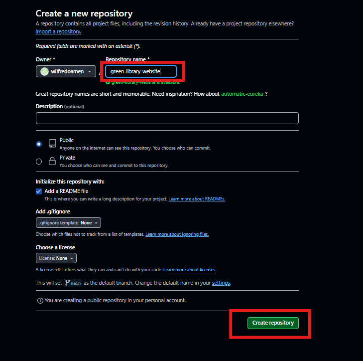

- [URL of Cloned Repository](https://github.com/wilfredoamen/green-library-website.git)

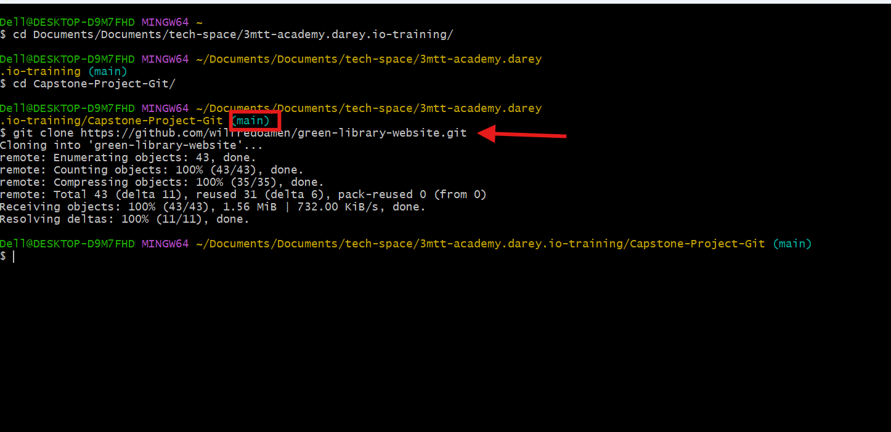

**ii**. Using VScode editor ensure there are *html* file for home,about_us,events and contact_us. With random content inside the each file.

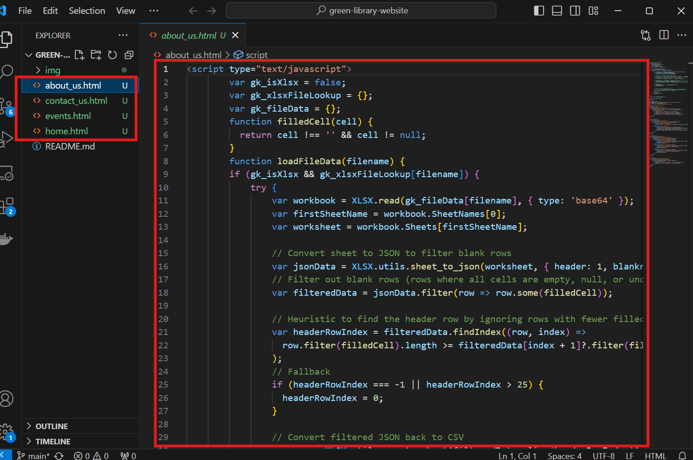

Using the following command below stage,commit and push the changes directly to the main branch.

```bash
# Stage Changes
git add .

# Commit Changes with a discriptive message
git commit -m "Discriptive message"

# Push Changes to github repository
git push origin main
```

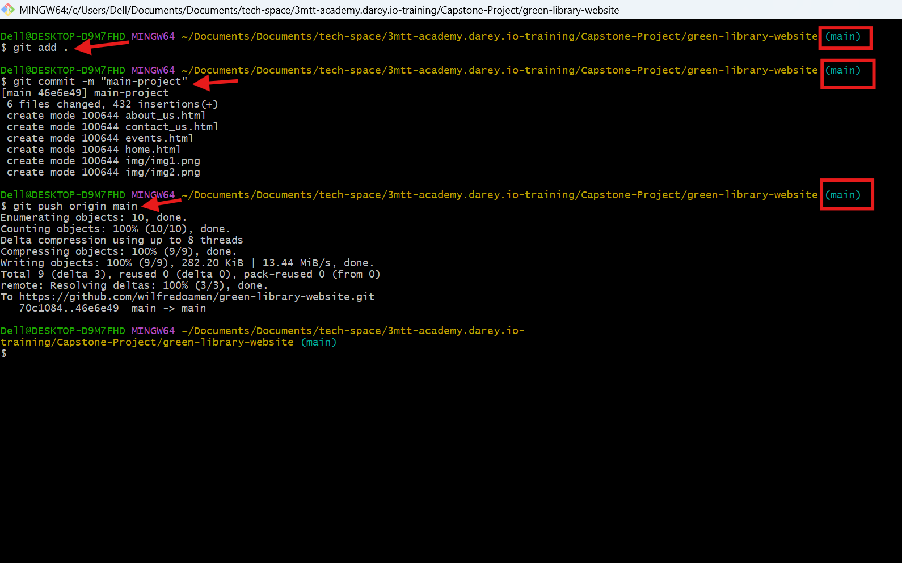


## Morgan's Workflow

**1**. Create a branch for Morgan and switch to the new branch **"add-book-reviews"**
by using the command below

```bash
# Create and switch to a branch
git checkout -b add-book-reviews
```
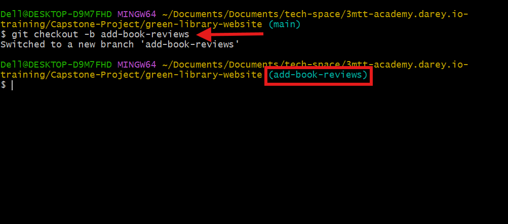

**2**. Add a new file **"book_reviews.html"** and add a random text content inside the file 

```bash
# Create a new file
touch book_reviews.html
```
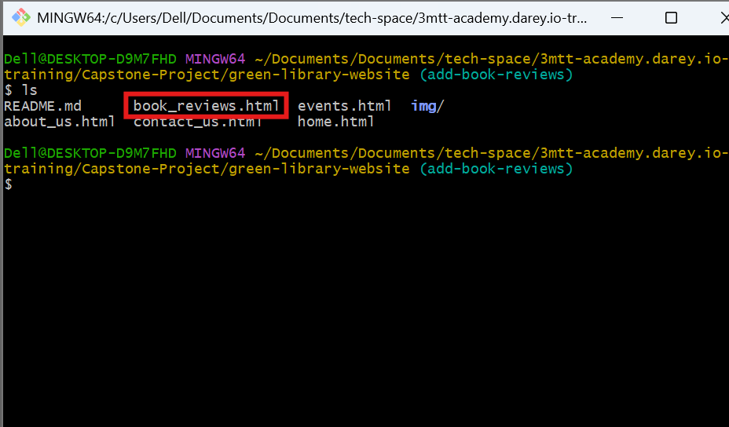

**3**. Stage,Commit and Push Morgan's changes by using the following command below.

```bash
# Add the file the staging area
git add book_reviews.html

# Commit the changes with a discriptive message
git commit -m "Add book review section"

# Push the changes to github repository
git push origin add-book-reviews
```

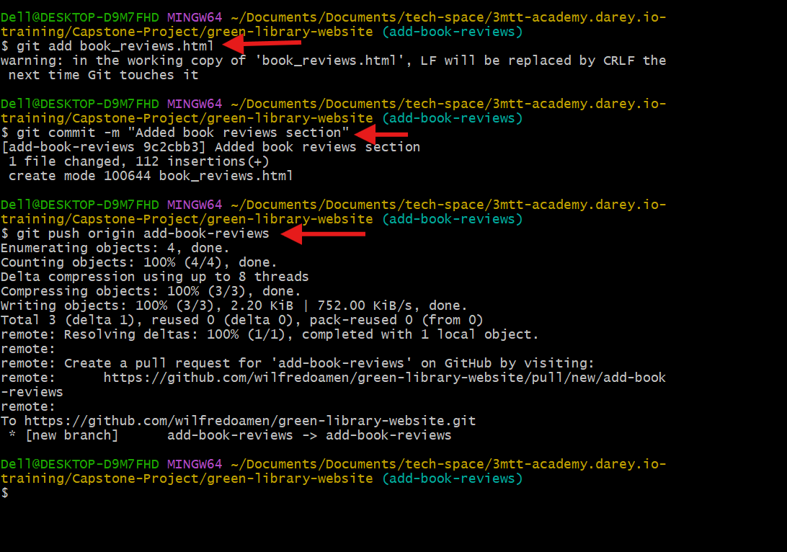

**4**. Create a pull request for Morgan's changes

- Open a web-broswer and navigate to the github repository.[Github-Url](https://github.com/wilfredoamen/green-library-website/tree/add-book-reviews)

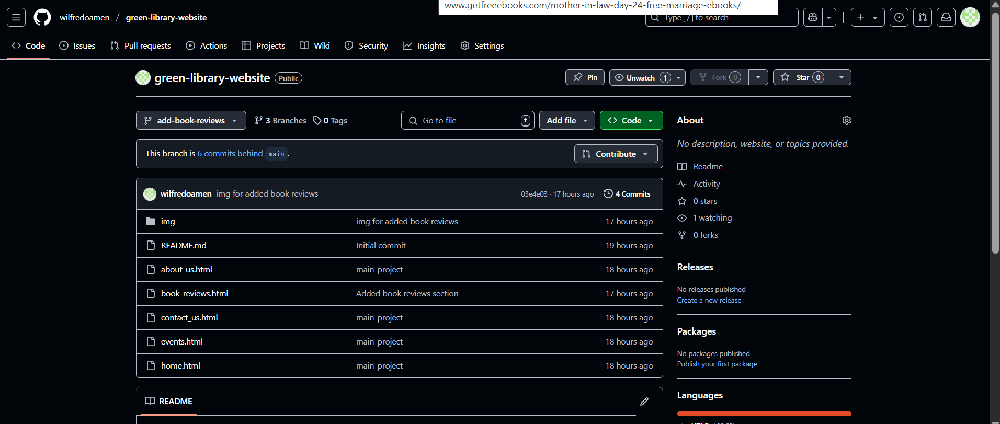

- Switch to Morgan's branch by clicking on the branch dropdown menu and select add-book-reviews branch, which is in this case Morgan's branch. After switching to morgan's branch click the dropdown menu *Contribute* and select *Open pull request*

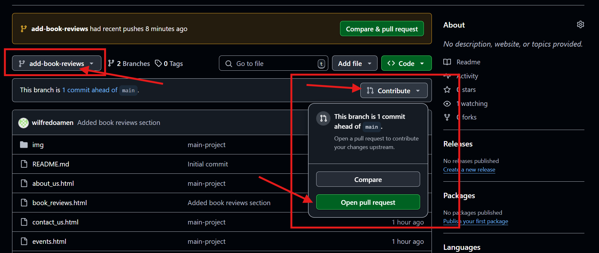

- After clicking the dropdown menu Contribute, followed by the Open pull request. These will automatically select the main project's branch as the base and Morgan's recently pushed branch "add-book-reviews" as the compare branch. Since everything look good, after providing a title and description for the pull request Click "*Create pull request*" to create a pull request.


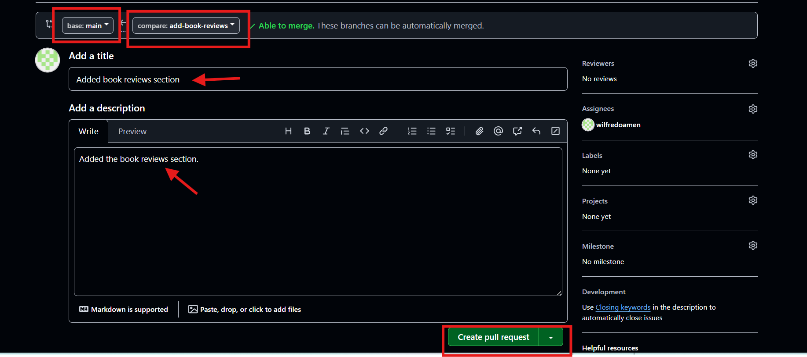

**5**. Review and Merge Morgan's Pull Request

Since the pull request is created and now visible to a team member who can review and merge Morgan's changes. The team member reviewing Morgan's changes approved and merges the pull request, since the term agrees with the changes.

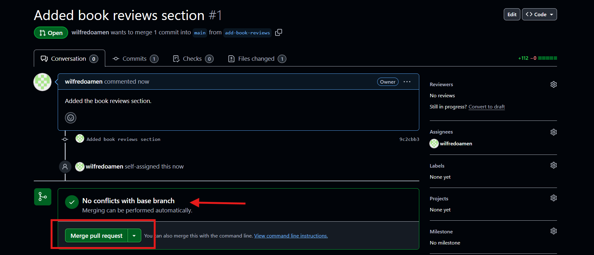

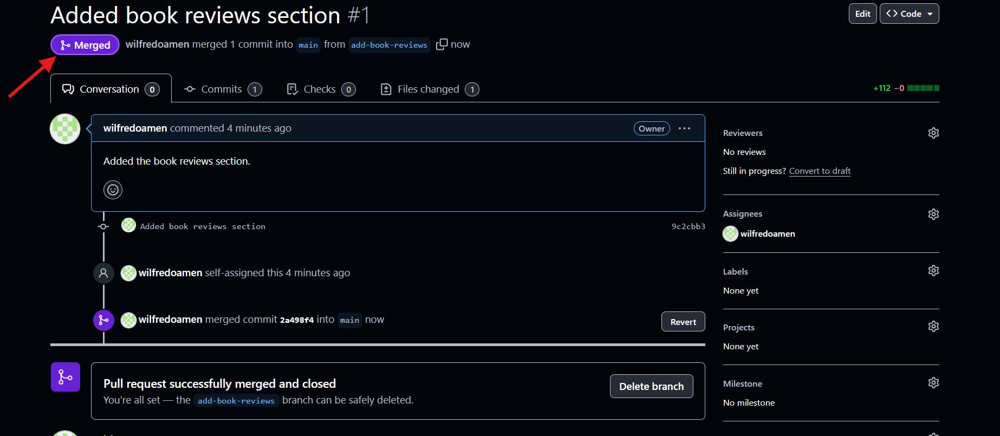
